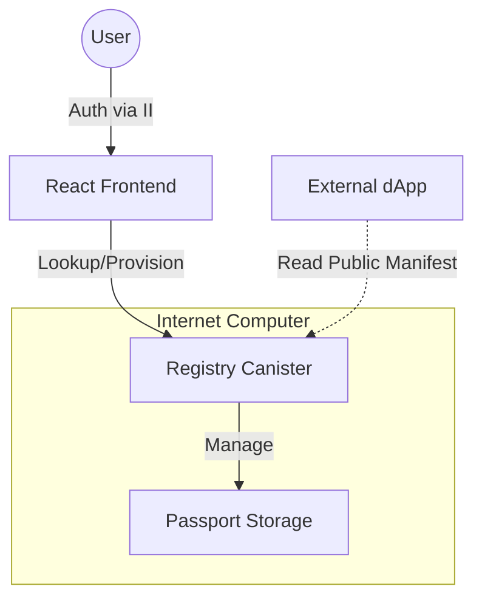

# 🆔 AI Passport
### Sovereign Digital Identity for the Age of AI


[](https://internetcomputer.org)

**AI Passport** is a decentralized protocol that gives users ownership of their AI agent's memory, personality, and preferences. Built on the **Internet Computer (ICP)**, it creates a portable "soul" for your AI that travels with you across applications, games, and metaverses.

📚 **Documentation**: [Architecture](docs/ARCHITECTURE.md) | [API Reference](docs/API_REFERENCE.md) | [Vision](docs/VISION.md) | [Roadmap](ROADMAP.md)

---

## 🏗 Architecture

The system follows a **Registry + Personal Storage** pattern to ensure data sovereignty and scalability.



### Core Components
1.  **Registry Canister**: The "Phonebook". Maps User Principals to their Passport data. Handles provisioning.
2.  **Passport Data**: Stores the user's `Profile`, `SystemConfig` (AI personality), and `Memories` (logs).
3.  **Frontend**: A modern React dashboard for users to manage their identity.

---

## ⚡ Quickstart

### Prerequisites
- Node.js v18+
- DFX SDK (v0.15+)

### Local Development
1.  **Start the local replica:**
    ```bash
    dfx start --clean --background
    ```

2.  **Deploy Canisters:**
    ```bash
    dfx deploy internet_identity
    dfx deploy registry
    ```

3.  **Configure Frontend:**
    - Copy the `registry` canister ID from the output.
    - Update `frontend/src/services/icp.ts`.

4.  **Run Frontend:**
    ```bash
    cd frontend
    npm install
    npm run dev
    ```

---

## 🔌 API Reference (Motoko)

### Registry (`src/registry/main.mo`)

#### `provision_passport()`
Creates a new passport for the authenticated caller.
- **Auth:** Required (Internet Identity)
- **Returns:** `Result<Principal, Error>`

#### `get_passport(user: Principal)`
Retrieves the passport ID for a given user.
- **Auth:** Public Query
- **Returns:** `?Principal`

#### `get_manifest()`
Returns the public-facing profile and memories. Designed for external apps.
- **Auth:** Public Query
- **Returns:** `PublicManifest`

---

## 🌍 Deploy to Mainnet

1.  **Get Cycles:** You need ICP tokens converted to cycles.
    ```bash
    dfx wallet --network ic balance
    ```

2.  **Deploy:**
    ```bash
    dfx deploy --network ic
    ```

3.  **Verify:**
    Access your frontend at `https://<canister-id>.ic0.app`.

---

## 🤝 Contributing
See [CONTRIBUTING.md](CONTRIBUTING.md) for details on how to submit pull requests.

## 📄 License
This project is licensed under the MIT License - see the [LICENSE](LICENSE) file for details.
