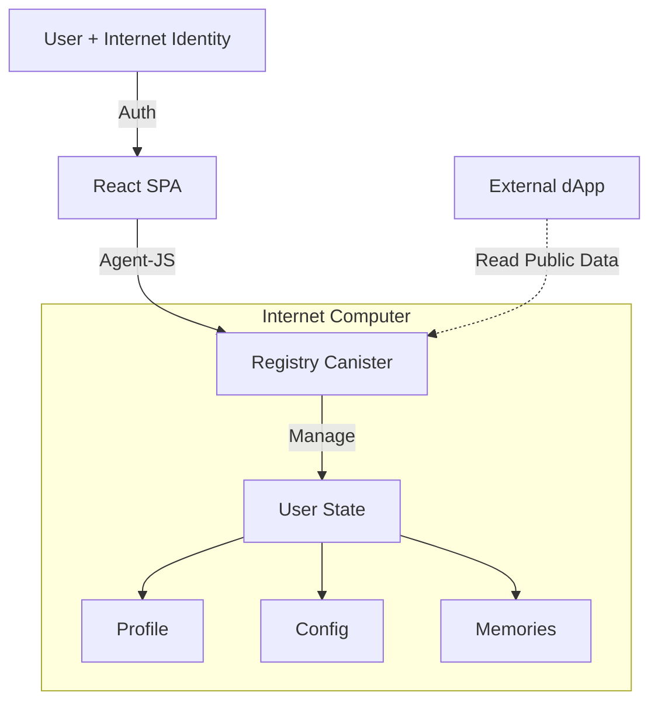

# 🏗 System Architecture

AI Passport is designed as a decentralized protocol on the Internet Computer.

## High-Level Overview

## Data Models

### Profile
Publicly visible information about the agent.
- `nickname`: Text
- `avatarUrl`: Text
- `bio`: Text
- `tags`: [Text]

### SystemConfig
The "Soul" of the agent. Defines personality.
- `corePrompt`: Text (The base instruction)
- `language`: Text
- `tone`: Enum (Formal, Casual, Pirate, Custom)

### MemoryEntry
Individual memory units.
- `id`: Nat
- `timestamp`: Int
- `content`: Text
- `visibility`: Public | Private | AuthorizedOnly

## Security Model
- **Authentication**: Internet Identity (II).
- **Authorization**: 
  - `isOwner` check for all write operations.
  - `get_manifest` filters out Private memories for public viewers.
