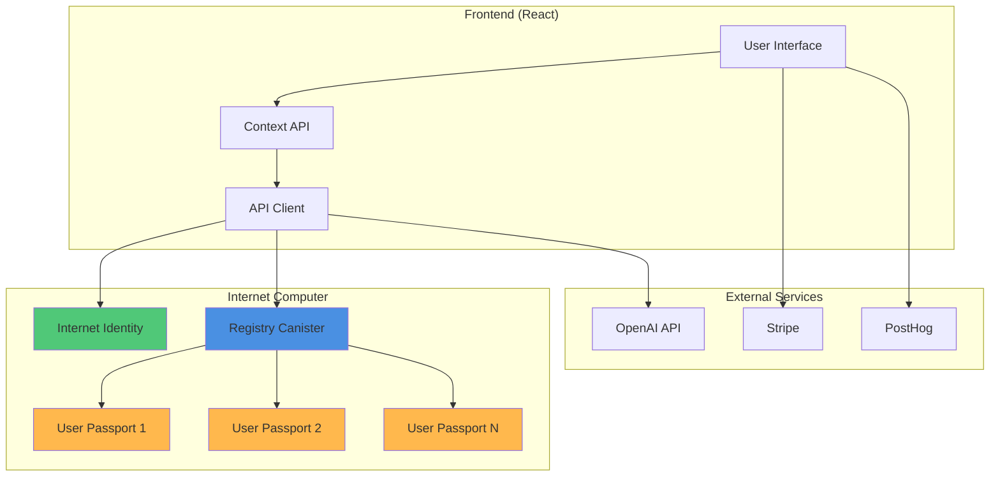
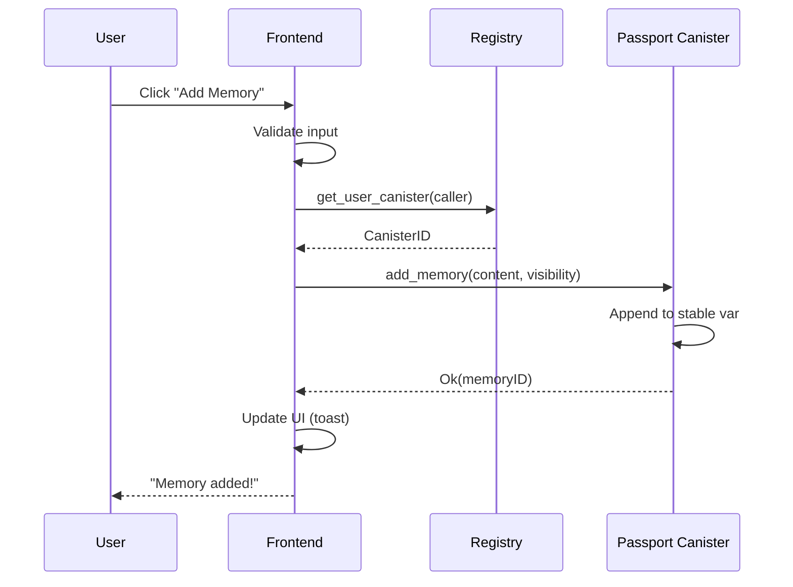
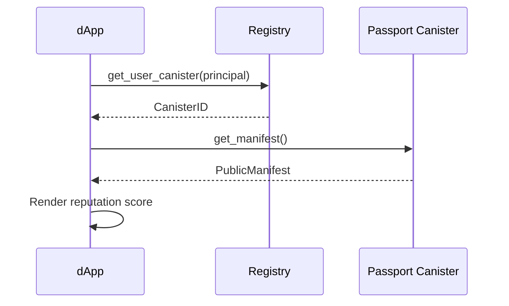

# AI Passport — Technical Architecture
**Version:** 1.1  
**Date:** November 30, 2025

---

## System Architecture Overview



---

## Current Architecture (v0.2 MVP)

### Single-Canister Registry

**Pros:**
- Simple deployment (one canister).
- Low latency (no inter-canister calls).
- Easy to reason about (all data in one place).

**Cons:**
- Memory limit: 4GB stable memory → ~10K users max.
- Single point of failure.
- Upgrade downtime affects all users.

**Data Structure:**
```motoko
stable var passports : HashMap<Principal, PassportData> = HashMap.init();

type PassportData = {
    profile : Profile;
    config : SystemConfig;
    memories : [MemoryEntry];
};
```

---

## Future Architecture (v1.0)

### Canister-per-User Model

**Pros:**
- Unlimited scale (spawn new canisters as needed).
- Isolation (one user's bug doesn't affect others).
- Independent upgrades (update user canisters without registry downtime).

**Cons:**
- Higher complexity (inter-canister calls).
- Cycles management (each canister needs funding).
- Slower reads (registry → user canister hop).

**Migration Path:**
1. **Dual Write** (Month 1-2): Registry saves data + spawns user canister.
2. **Data Migration** (Month 3): Script copies existing data to user canisters.
3. **Switch Reads** (Month 4): Frontend reads from user canisters, registry becomes index.

---

## Component Breakdown

### 1. Registry Canister

**Responsibilities:**
- Map `Principal → CanisterID`.
- Spawn new user canisters.
- Aggregate queries (e.g., "top 10 users by memory count").

**API:**
```motoko
public shared({caller}) func provision_passport() : async Result<CanisterID, Error>;
public query func get_user_canister(user : Principal) : async ?CanisterID;
public query func get_leaderboard() : async [LeaderboardEntry];
```

**Storage:**
```motoko
stable var userIndex : HashMap<Principal, CanisterID> = HashMap.init();
```

---

### 2. User Passport Canister

**Responsibilities:**
- Store user's profile + memories.
- Enforce access control (only owner can write).
- Expose public manifest.

**API:**
```motoko
public shared({caller}) func update_profile(p : Profile) : async Result<(), Error>;
public shared({caller}) func add_memory(content : Text, vis : Visibility) : async Result<MemoryID, Error>;
public query func get_full_state() : async FullState;
public query func get_manifest() : async PublicManifest;
```

**Storage:**
```motoko
stable var profile : Profile = defaultProfile;
stable var memories : [MemoryEntry] = [];
```

---

### 3. Internet Identity

**Integration:**
- Users authenticate via II (no passwords).
- Session delegation (30-day expiry).
- Multi-device support (same identity across devices).

**Frontend Flow:**
```typescript
const authClient = await AuthClient.create();
await authClient.login({
  identityProvider: "https://identity.ic0.app",
  onSuccess: () => {
    const identity = authClient.getIdentity();
    const principal = identity.getPrincipal();
    // Call registry.provision_passport()
  }
});
```

---

### 4. Frontend (React)

**State Management:**
- **Global**: `PassportContext` (profile, memories, config).
- **Local**: Component state (form inputs, UI toggles).
- **Persistent**: `localStorage` (filters, sort order).

**Key Libraries:**
- `@dfinity/agent`: ICP communication.
- `@dfinity/auth-client`: II authentication.
- `react-router-dom`: Routing.
- `tailwindcss`: Styling.
- `lucide-react`: Icons.

**Build:**
```bash
npm run build  # → dist/
dfx deploy frontend  # Upload to asset canister
```

---

## Data Flow Examples

### Example 1: Add Memory



---

### Example 2: Query Public Manifest (External dApp)



---

## Technology Stack

### Backend
| Component | Technology | Rationale |
|-----------|-----------|-----------|
| Smart Contracts | Motoko | Native IC language, type-safe |
| Storage | Stable Variables | Survives upgrades |
| Authentication | Internet Identity | Decentralized, no passwords |
| Cycles Management | CMC (Cycles Minting Canister) | Auto-topup |

### Frontend
| Component | Technology | Rationale |
|-----------|-----------|-----------|
| Framework | React 18 | Industry standard, large ecosystem |
| Build Tool | Vite | Fast HMR, modern |
| Styling | Tailwind CSS | Utility-first, rapid prototyping |
| State | Context API | Simple, no Redux overhead |
| Routing | React Router v6 | Declarative, nested routes |

### Infrastructure
| Component | Technology | Rationale |
|-----------|-----------|-----------|
| Hosting | IC Asset Canister | Decentralized, fast CDN |
| Monitoring | Grafana + Prometheus | Open-source, IC-compatible |
| Analytics | PostHog | Privacy-first, self-hostable |
| Payments | Stripe + ICP Ledger | Fiat + crypto support |

---

## Scalability Analysis

### Current Limits (Single-Canister)
- **Memory**: 4GB stable storage.
- **Users**: ~10K (assuming 400KB/user).
- **Queries**: ~1K req/sec (IC canister limit).

### Future Limits (Canister-per-User)
- **Memory**: Unlimited (spawn new canisters).
- **Users**: Millions (limited by cycles budget).
- **Queries**: ~1M req/sec (distributed across canisters).

### Cost Projection (ICP Cycles)
- **Single Canister**: ~$50/month (10K users).
- **Canister-per-User**: ~$0.005/user/month → $5K/month for 1M users.

**Mitigation**: Users pay for their own canister (via subscription or one-time fee).

---

## Deployment Strategy

### Environments
1. **Local**: DFX (development).
2. **Testnet**: IC Testnet (staging).
3. **Mainnet**: IC Mainnet (production).

### CI/CD Pipeline
```yaml
# .github/workflows/deploy.yml
on:
  push:
    branches: [main]

jobs:
  deploy:
    runs-on: ubuntu-latest
    steps:
      - uses: actions/checkout@v3
      - name: Install DFX
        run: sh -ci "$(curl -fsSL https://sdk.dfinity.org/install.sh)"
      - name: Deploy to Mainnet
        run: |
          dfx deploy --network ic registry
          dfx deploy --network ic frontend
```

### Rollback Plan
- **Canister Snapshots**: Daily backups via `dfx canister snapshot`.
- **Version Pinning**: Tag releases (`v1.0.0`, `v1.0.1`).
- **Instant Rollback**: `dfx canister install --mode reinstall --wasm v1.0.0.wasm`.

---

## Performance Optimization

### Backend
- **Query Calls**: Use `query` (not `update`) for reads → 10x faster.
- **Batch Operations**: `add_memories([...])` instead of N calls.
- **Indexing**: Maintain sorted lists for leaderboards.

### Frontend
- **Code Splitting**: Lazy load routes (`React.lazy`).
- **Memoization**: `useMemo` for expensive computations.
- **Debouncing**: Search input (300ms delay).
- **Virtualization**: Render only visible memories (react-window).

### Network
- **CDN**: IC asset canister serves static files globally.
- **Compression**: Gzip/Brotli for API responses.
- **Caching**: `Cache-Control` headers (1 hour for static assets).

---

## Monitoring & Observability

### Metrics to Track
- **Canister Cycles**: Alert if < 1T cycles remaining.
- **Memory Usage**: Alert if > 80% of 4GB.
- **Error Rate**: Alert if > 1% of requests fail.
- **Latency**: P50, P95, P99 (target: < 500ms).

### Logging
- **Frontend**: PostHog (user actions).
- **Backend**: IC logs (`dfx canister logs`).
- **Errors**: Sentry (crash reports).

### Dashboards
- **Grafana**: Real-time canister metrics.
- **PostHog**: User funnels, retention cohorts.

---

**Next:** See [ROADMAP_PART5_SECURITY.md](./ROADMAP_PART5_SECURITY.md) for security model and threat analysis.
